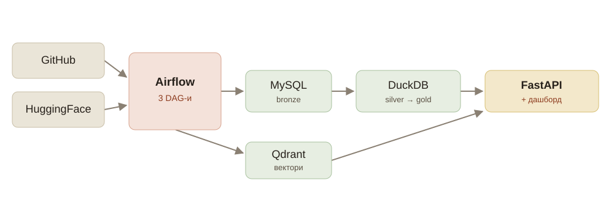
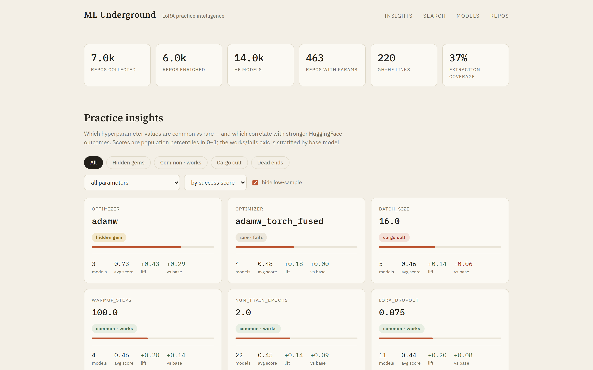
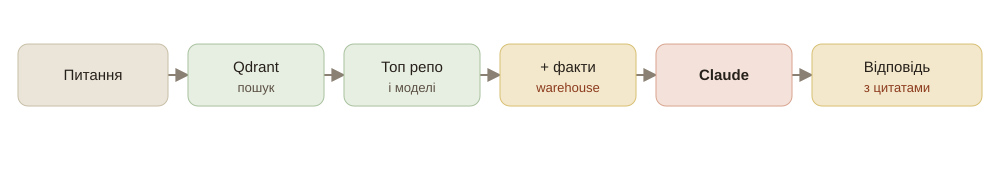
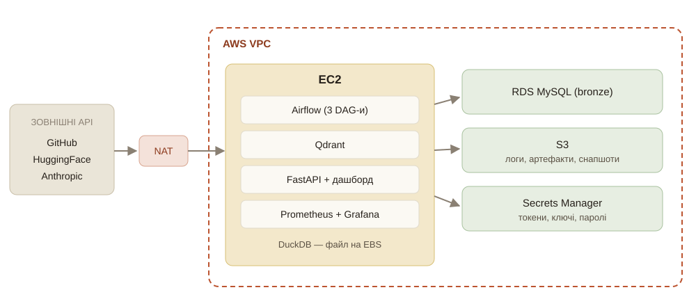
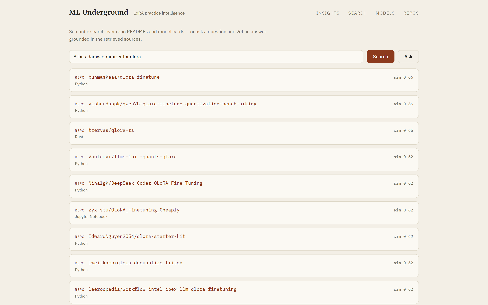
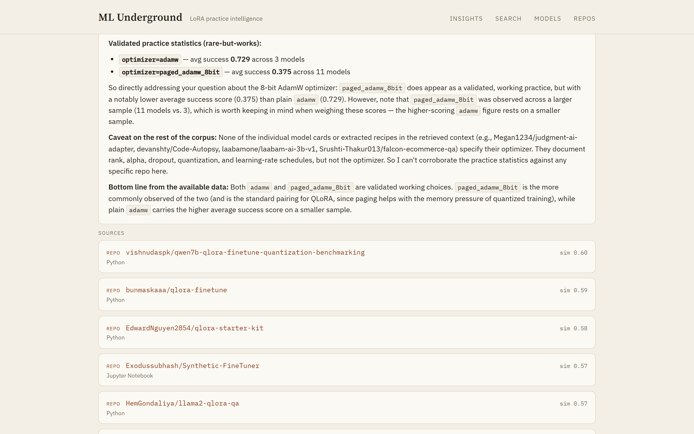

<!-- _class: title -->
<!-- _paginate: false -->

LoRA Practice Intelligence

# ML Underground — пошук рідкісних, але дієвих практик донавчання LoRA

Команда

Саваріна Дарина, Козін Андрій, Авдєєнко Дмитро, Мигаль Максим

<!--
UK: [Дарина Саваріна] Доброго дня! Ми представляємо ML Underground — платформу, що знаходить рідкісні, але ефективні практики донавчання LoRA. Я почну з ідеї, далі Андрій — про дані, Дмитро — про ML і пошук, Максим — про розгортання.
-->

---

# ПРОБЛЕМА ТА ІДЕЯ

### Проблема

- Практик донавчає LoRA за розрізненими туторіалами
- Немає способу дізнатися, що **реально працює**
- Популярне не дорівнює ефективне

### Ідея

- Зібрати реальні конфіги з GitHub
- Звірити з успіхом моделей на HuggingFace
- Виокремити рідкісні практики, що корелюють з успіхом

<!--
UK: [Дарина Саваріна] Тренуючи LoRA, ти спираєшся на туторіали і власний досвід — і ніяк не перевіриш, що з цього справді працює. Багато «загальновідомих» налаштувань — це cargo cult. Наша ідея: зібрати реальні конфіги з GitHub, звірити з метриками успіху моделей на HuggingFace, і виокремити рідкісні практики, що корелюють з успіхом. Натхнення — стаття Kahana про приховані самоцвіти в репозиторіях моделей.
-->

---

# ЧОТИРИ КВАДРАНТИ — ЯДРО ПРОДУКТУ

<h3>Rare + Works — прихований самоцвіт</h3>

Рідкісне і працює. Те, що шукаємо.

<h3>Common + Works — база</h3>

Усі так роблять, і це працює.

<h3>Common + Fails — cargo cult</h3>

Популярне, але неефективне.

<h3>Rare + Fails — глухий кут</h3>

Експериментальне і невдале.

<!--
UK: [Дарина Саваріна] Ядро продукту — чотири квадранти. Кожне значення гіперпараметра розкладаємо за двома осями: поширеність і успіх. Найцінніший — rare-but-works, прихований самоцвіт. Протилежний — cargo cult: популярне, а не працює. Я проєктувала user flow і дашборд навколо цих квадрантів: користувач бачить інсайт, докази у вигляді реальних моделей, і може шукати практики природною мовою.
-->

---

# ЗБІР І ОБРОБКА ДАНИХ

Прицільний збір з GitHub і HuggingFace, оркестрація Airflow, медальйон у DuckDB.

<!--
UK: [Андрій Козін] Дані йдуть з двох джерел: прицільний пошук репозиторіїв на GitHub за топіками lora, qlora, peft із збагаченням через API, і модельки з HuggingFace разом з картками та сигналами успіху — завантаження, лайки, fan-out. Оркеструє все Airflow трьома DAG-ами. Сирі дані лягають у MySQL bronze, далі через dbt будується медальйон у DuckDB — silver і gold. Паралельно тексти заембеджуються в Qdrant. На виході все живить застосунок.
-->

---

# ВИТЯГ ПАРАМЕТРІВ

- Шари за пріоритетом: **AST > JSON > YAML > regex > LLM**; LLM-fallback (Claude Haiku) для нестандартних репо
- Variant D: параметри прямо з HF-карток — без зв'язування GitHub і HF

6 986

репозиторіїв

13 996

HuggingFace-моделей

7 159

з параметрами

37%

покриття витягу

<!--
UK: [Андрій Козін] Гіперпараметри витягуємо шарами за пріоритетом — від точного AST-парсингу до regex, а для нестандартних репо вмикається LLM-fallback на Claude Haiku. Окремий хід — Variant D: параметри беремо прямо з карток HuggingFace, тож не залежимо від крихкого зв'язування GitHub з HF. У числах: майже сім тисяч репо, чотирнадцять тисяч моделей, сім тисяч з розпарсеними параметрами.
-->

---

# SUCCESS SCORE ТА КВАДРАНТИ

### Композитний score (0–1)

- Перцентилі сигналів, зважена суміш:
- **0.55 завантаження + 0.35 лайки + 0.10 fan-out**

### Надійність квадрантів

- Стратифікація по `base_model`
- `sample_ok`: щонайменше 3 моделі
- Кореляція, не каузація

<!--
UK: [Дмитро Авдєєнко] Щоб квадранти мали сенс, потрібен чесний показник успіху. Композитний score — зважена суміш перцентилів: 0.55 завантаження, 0.35 лайки, 0.10 fan-out. Fan-out малий навмисно — для адаптерів він структурно майже нульовий. Надійність: стратифікуємо по base_model, щоб не плутати ефективність із популярністю бази; бакети менш ніж з трьох моделей позначаємо як шум. На скріні — дашборд: картки квадрантів зі score, lift і кількістю моделей.
-->

---

# СЕМАНТИЧНИЙ ПОШУК І ASK

- Ембеддинги README і карток у Qdrant (all-MiniLM-L6-v2)
- Запит природною мовою → найближчі репозиторії та моделі

- Ask: відповідь Claude, заземлена в знайденому + факти warehouse
- Захист від prompt injection; чесне «недостатньо інформації»

<!--
UK: [Дмитро Авдєєнко] Поверх корпусу — два режими. Пошук: README і картки заембеджені в Qdrant, запит природною мовою повертає найближчі репо і моделі. Ask — це RAG: знаходимо релевантні джерела, тоді Claude відповідає, заземлений саме в них, плюс факти зі сховища — витягнуті рецепти і статистика rare-but-works. Є захист від ін'єкцій, і модель чесно каже, коли інформації бракує.
-->

---

# РОЗГОРТАННЯ НА AWS

Уся інфраструктура — як код (Terraform); розкат через `terraform apply`.

<!--
UK: [Максим Мигаль] Розгортання — повністю на AWS, описане в Terraform. EC2 тримає Airflow, Qdrant, застосунок і моніторинг; RDS MySQL — bronze-шар; S3 — логи, артефакти і снапшоти; усі секрети в Secrets Manager. Сервіс ходить у GitHub, HuggingFace і Anthropic, тож для приватних підмереж є NAT. Великий плюс DuckDB: warehouse — просто файл на диску, без окремого хмарного сховища.
-->

---

# ДЕПЛОЙ І ДАНІ

### Міграція даних

- MySQL → RDS (`mysqldump`)
- Qdrant — снапшоти колекцій (14k+ векторів)
- DuckDB — похідний, регенерується
- Дані вже на S3

### Образи і критерії

- ECR: Airflow, exporter, застосунок
- `terraform apply` без ручних кроків, усі три DAG-и зелені
- Повний деплой завершуємо окремим PR

<!--
UK: [Максим Мигаль] Дані переносимо так: MySQL через mysqldump у RDS, Qdrant — снапшотами колекцій, це понад чотирнадцять тисяч векторів. DuckDB копіювати не треба — він похідний, регенерується. Дані вже на S3. В ECR — образи Airflow, exporter і застосунку. Критерій готовності: terraform apply без ручних кроків і всі три DAG-и зелені. Повний деплой завершуємо окремим pull request.
-->

---

<!-- _class: demo -->

# ДЕМОНСТРАЦІЯ

ml-underground.xyz

Інсайти і квадранти, семантичний пошук, Ask із відповіддю на основі корпусу.

<!--
UK: [Дмитро Авдєєнко] А тепер покажемо наживо: інсайти і квадранти, семантичний пошук по корпусу і Ask, де відповідь будується на знайдених джерелах і фактах сховища. (Якщо демо не відкриється — далі є скріни.)
-->

---

<!-- _class: shot -->

# ДАШБОРД — ІНСАЙТИ

<!--
UK: [Дмитро Авдєєнко] Запасний варіант: головний екран — KPI корпусу і картки практик за квадрантами.
-->

---

<!-- _class: shot -->

# СЕМАНТИЧНИЙ ПОШУК

<!--
UK: [Дмитро Авдєєнко] Семантичний пошук: запит природною мовою і найближчі репозиторії та моделі зі схожістю.
-->

---

<!-- _class: shot -->

# ASK — ВІДПОВІДЬ З ДЖЕРЕЛАМИ

<!--
UK: [Дмитро Авдєєнко] Ask: відповідь, заземлена у фактах warehouse, з цитованими джерелами знизу.
-->

---

<!-- _class: end -->
<!-- _paginate: false -->

# ДЯКУЄМО ЗА УВАГУ!

## Саваріна Дарина, Козін Андрій, Авдєєнко Дмитро, Мигаль Максим

<!--
UK: Дякуємо за увагу! Готові відповісти на запитання.
-->
